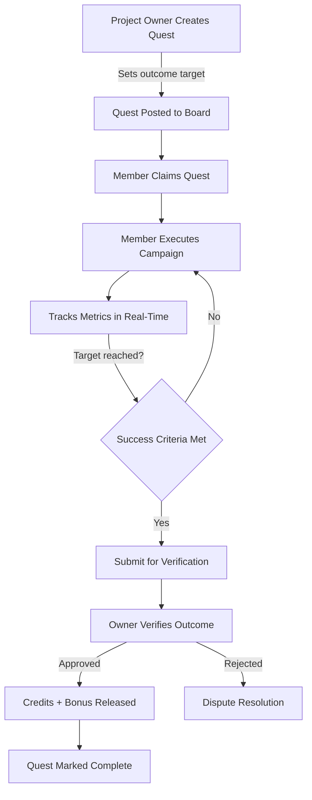
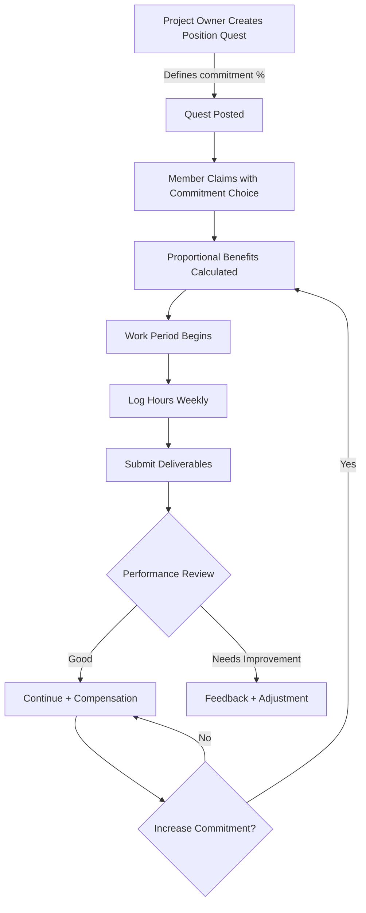

# Side Quests System Architecture

## Overview
Universal "work when you want, as much as you want" system for flexible employment across ALL projects in the Liana Banyan ecosystem.

**Key Differentiator**: 
- **Initiatives** = LB-owned community service projects
- **Side Quests** = Flexible work opportunities on ANY member project

---

## Core Concept

### Netherlands-Style Percentage Employment
- Workers choose commitment level: 10%, 25%, 50%, 100%
- Proportional benefits scale with commitment
- Multiple simultaneous quests allowed
- Flexible scheduling within commitment bounds

### Quest Categories

#### 1. Marketing Tasks
**Outcome-Based Rewards**
- "Design Let's Make Dinner landing page - 500 credits for 50 signups"
- "Create social media campaign - 300 credits for 1000 views"
- "Write blog post - 200 credits + performance bonus"

**Why This Works**:
- Cheaper than agencies ($50-500 vs $5k-50k)
- Accessible gig work for members
- Clear success metrics
- Scalable rewards

#### 2. Position Fulfillment
**Variable Commitment Contracts**
- HR Assistant - 25% commitment (10hrs/week)
- Marketing Coordinator - 50% commitment (20hrs/week)  
- Full-time Steward - 100% commitment (40hrs/week)

**Benefits**:
- Proportional equity/cash compensation
- Scalable benefits (health, retirement)
- Guild access at 25%+ commitment
- Path to full-time

#### 3. Initiative Service Delivery
**Community Service Work**
- Let's Make Dinner: Meal prep slots (10% commitment = 2 meals/week)
- Let's Go Shopping: Personal shopper coordination
- Defense Claws: Intake support and case management
- LifeLine Medications: Research and assistance

---

## Database Schema

### Core Tables

```sql
-- Main quest board
CREATE TABLE side_quests (
  id UUID PRIMARY KEY DEFAULT gen_random_uuid(),
  project_id UUID REFERENCES projects(id) NOT NULL,
  created_by UUID REFERENCES profiles(id) NOT NULL,
  
  -- Quest metadata
  quest_type TEXT NOT NULL CHECK (quest_type IN ('marketing', 'position', 'service', 'contract')),
  title TEXT NOT NULL,
  description TEXT NOT NULL,
  requirements JSONB DEFAULT '[]',
  
  -- Commitment structure
  commitment_percentage INTEGER CHECK (commitment_percentage IN (10, 25, 50, 100)),
  time_flexibility TEXT CHECK (time_flexibility IN ('anytime', 'scheduled', 'deadline', 'recurring')),
  estimated_hours_per_week INTEGER,
  duration_weeks INTEGER,
  
  -- Compensation
  reward_credits NUMERIC NOT NULL DEFAULT 0,
  reward_cash NUMERIC DEFAULT 0,
  equity_percentage NUMERIC DEFAULT 0,
  bonus_structure JSONB DEFAULT '{}',
  
  -- Outcome tracking (for marketing quests)
  outcome_metrics JSONB DEFAULT '{}', -- {type: 'signups', target: 50, current: 0}
  success_criteria TEXT,
  
  -- Status
  status TEXT NOT NULL DEFAULT 'open' CHECK (status IN ('open', 'claimed', 'in_progress', 'completed', 'cancelled')),
  max_claimants INTEGER DEFAULT 1,
  current_claimants INTEGER DEFAULT 0,
  
  -- Scheduling
  start_date TIMESTAMPTZ,
  deadline TIMESTAMPTZ,
  
  created_at TIMESTAMPTZ NOT NULL DEFAULT NOW(),
  updated_at TIMESTAMPTZ NOT NULL DEFAULT NOW()
);

-- User quest claims and progress
CREATE TABLE side_quest_claims (
  id UUID PRIMARY KEY DEFAULT gen_random_uuid(),
  quest_id UUID REFERENCES side_quests(id) NOT NULL,
  user_id UUID REFERENCES profiles(id) NOT NULL,
  
  -- Claim details
  claimed_at TIMESTAMPTZ NOT NULL DEFAULT NOW(),
  started_at TIMESTAMPTZ,
  completed_at TIMESTAMPTZ,
  
  -- Progress tracking
  progress_percentage INTEGER DEFAULT 0 CHECK (progress_percentage >= 0 AND progress_percentage <= 100),
  hours_logged NUMERIC DEFAULT 0,
  deliverables_submitted JSONB DEFAULT '[]',
  
  -- Outcome achievement (marketing quests)
  outcome_achieved JSONB DEFAULT '{}', -- {signups: 52, views: 1200}
  outcome_verified BOOLEAN DEFAULT FALSE,
  verified_by UUID REFERENCES profiles(id),
  verified_at TIMESTAMPTZ,
  
  -- Payment
  payment_status TEXT DEFAULT 'pending' CHECK (payment_status IN ('pending', 'approved', 'paid', 'disputed')),
  credits_awarded NUMERIC DEFAULT 0,
  cash_awarded NUMERIC DEFAULT 0,
  equity_awarded NUMERIC DEFAULT 0,
  bonus_awarded NUMERIC DEFAULT 0,
  paid_at TIMESTAMPTZ,
  
  -- Performance
  quality_rating INTEGER CHECK (quality_rating >= 1 AND quality_rating <= 5),
  feedback TEXT,
  
  created_at TIMESTAMPTZ NOT NULL DEFAULT NOW(),
  updated_at TIMESTAMPTZ NOT NULL DEFAULT NOW(),
  
  UNIQUE(quest_id, user_id)
);

-- Proportional benefits for commitment-based quests
CREATE TABLE side_quest_benefits (
  id UUID PRIMARY KEY DEFAULT gen_random_uuid(),
  claim_id UUID REFERENCES side_quest_claims(id) NOT NULL,
  user_id UUID REFERENCES profiles(id) NOT NULL,
  
  -- Benefit eligibility based on commitment
  commitment_percentage INTEGER NOT NULL,
  health_benefits_eligible BOOLEAN DEFAULT FALSE,
  retirement_eligible BOOLEAN DEFAULT FALSE,
  guild_access_eligible BOOLEAN DEFAULT FALSE,
  
  -- Proportional calculations
  base_compensation NUMERIC NOT NULL,
  proportional_compensation NUMERIC NOT NULL,
  benefits_value_monthly NUMERIC DEFAULT 0,
  
  -- Benefit details
  health_contribution_monthly NUMERIC DEFAULT 0,
  retirement_contribution_percentage NUMERIC DEFAULT 0,
  
  effective_from TIMESTAMPTZ NOT NULL DEFAULT NOW(),
  effective_until TIMESTAMPTZ,
  
  created_at TIMESTAMPTZ NOT NULL DEFAULT NOW(),
  updated_at TIMESTAMPTZ NOT NULL DEFAULT NOW()
);

-- Quest deliverables and proof of work
CREATE TABLE quest_deliverables (
  id UUID PRIMARY KEY DEFAULT gen_random_uuid(),
  claim_id UUID REFERENCES side_quest_claims(id) NOT NULL,
  
  deliverable_type TEXT NOT NULL CHECK (deliverable_type IN ('file', 'link', 'metrics', 'report')),
  title TEXT NOT NULL,
  description TEXT,
  
  -- Content
  file_url TEXT,
  external_url TEXT,
  metrics_data JSONB,
  
  submitted_at TIMESTAMPTZ NOT NULL DEFAULT NOW(),
  reviewed_at TIMESTAMPTZ,
  approved BOOLEAN,
  reviewer_notes TEXT,
  
  created_at TIMESTAMPTZ NOT NULL DEFAULT NOW()
);
```

### Indexes for Performance
```sql
CREATE INDEX idx_side_quests_status ON side_quests(status) WHERE status = 'open';
CREATE INDEX idx_side_quests_project ON side_quests(project_id);
CREATE INDEX idx_side_quests_type ON side_quests(quest_type);
CREATE INDEX idx_side_quest_claims_user ON side_quest_claims(user_id);
CREATE INDEX idx_side_quest_claims_status ON side_quest_claims(payment_status);
```

---

## UI Components Architecture

### Quest Discovery
```
SideQuestsBoard.tsx
├── Filter by quest_type (marketing, position, service)
├── Filter by commitment_percentage
├── Filter by time_flexibility
├── Sort by reward_credits, deadline
└── Quest cards with claim button

SideQuestCard.tsx
├── Quest title and description
├── Commitment badge (10%, 25%, 50%, 100%)
├── Reward display (credits, cash, equity)
├── Success criteria (for marketing)
├── Deadline countdown
└── Claim button (if open)
```

### User Quest Management
```
MySideQuests.tsx
├── Active Quests Tab
│   ├── Progress tracking
│   ├── Hours logged
│   ├── Deliverables checklist
│   └── Submit work button
│
├── Completed Quests Tab
│   ├── Payment status
│   ├── Feedback/ratings
│   └── Earnings history
│
└── Benefits Dashboard (25%+ commitment)
    ├── Health benefits status
    ├── Retirement contributions
    └── Guild access level
```

### Quest Creation (Project Owners)
```
CreateSideQuestDialog.tsx
├── Quest type selection
├── Title and description
├── Commitment level selector
├── Reward configuration
│   ├── Credits slider
│   ├── Cash input (optional)
│   └── Equity percentage (position quests)
├── Success criteria builder (marketing)
├── Time flexibility options
└── Publish button
```

### Progress Tracking
```
SideQuestProgress.tsx
├── Progress percentage display
├── Hours logged vs estimated
├── Deliverables submission
│   ├── File upload
│   ├── Link input
│   └── Metrics tracker (for marketing)
├── Status updates
└── Request review button
```

---

## Workflow Diagrams

### Marketing Quest Flow


### Position Quest Flow


---

## Business Rules

### Commitment Levels
```typescript
const COMMITMENT_BENEFITS = {
  10: { health: false, retirement: false, guild: false },
  25: { health: false, retirement: true, guild: true },
  50: { health: true, retirement: true, guild: true },
  100: { health: true, retirement: true, guild: true, priority: true }
};

const PROPORTIONAL_CALCULATION = (baseCompensation: number, commitment: number) => {
  return baseCompensation * (commitment / 100);
};
```

### Marketing Quest Validation
```typescript
interface MarketingOutcome {
  type: 'views' | 'signups' | 'conversions' | 'engagement';
  target: number;
  current: number;
  verified: boolean;
}

const validateOutcome = (outcome: MarketingOutcome): boolean => {
  return outcome.current >= outcome.target && outcome.verified;
};
```

### Payment Logic
```typescript
const calculatePayment = (quest: SideQuest, claim: SideQuestClaim) => {
  let total = quest.reward_credits;
  
  // Bonus for exceeding targets
  if (quest.quest_type === 'marketing' && claim.outcome_achieved) {
    const overPerformance = 
      (claim.outcome_achieved.current - quest.outcome_metrics.target) / 
      quest.outcome_metrics.target;
    
    if (overPerformance > 0) {
      total += quest.bonus_structure.over_target_percentage * overPerformance;
    }
  }
  
  // Quality bonus
  if (claim.quality_rating >= 4) {
    total += quest.bonus_structure.quality_bonus || 0;
  }
  
  return total;
};
```

---

## Integration Points

### With Existing Systems

1. **Project Funding**:
   - Side quest rewards deducted from project_funding.available_pot
   - Benefits paid from LB funding pool (25%+ commitment)

2. **User Credits**:
   - Earnings added to user_credits.contribution_credits
   - Tracks side_quest_earnings separately

3. **Guild System**:
   - 25%+ commitment grants guild_access
   - Quest work counts toward guild progression

4. **Position System**:
   - Position-type quests can convert to full contracts
   - Equity from quests tracked in project_member_contracts

5. **Reputation System**:
   - Quality ratings feed into user_reputation_ratings
   - Completed quests boost reputation score

---

## RLS Policies

```sql
-- Anyone can view open quests
CREATE POLICY "Anyone can view open side quests"
ON side_quests FOR SELECT
USING (status = 'open');

-- Project owners can manage their quests
CREATE POLICY "Project owners can manage side quests"
ON side_quests FOR ALL
USING (
  EXISTS (
    SELECT 1 FROM projects
    WHERE projects.id = side_quests.project_id
    AND projects.owner_id = auth.uid()
  )
);

-- Users can claim quests
CREATE POLICY "Users can claim side quests"
ON side_quest_claims FOR INSERT
WITH CHECK (user_id = auth.uid());

-- Users can view and update own claims
CREATE POLICY "Users can manage own claims"
ON side_quest_claims FOR ALL
USING (user_id = auth.uid());

-- Project owners can review claims
CREATE POLICY "Project owners can review claims"
ON side_quest_claims FOR SELECT
USING (
  EXISTS (
    SELECT 1 FROM side_quests sq
    JOIN projects p ON p.id = sq.project_id
    WHERE sq.id = side_quest_claims.quest_id
    AND p.owner_id = auth.uid()
  )
);
```

---

## Success Metrics

### Platform Goals
- 1000+ active side quests within 6 months
- 50% of members earning via side quests
- Average 3 simultaneous quests per active user
- 80% quest completion rate

### User Success
- Clear path from 10% → 100% commitment
- Average $500-$2000/month at 50% commitment
- Benefits access at 25%+ commitment
- Positive reputation growth from quest work

---

## Next Steps

1. ⏸️ **Wait for Supabase types regeneration**
2. Create database migration with above schema
3. Build core UI components
4. Implement quest claiming workflow
5. Add progress tracking and deliverable submission
6. Create payment and verification system
7. Integrate with benefits calculation
8. Test with pilot marketing quests

---

**Status**: Design Complete - Ready for Implementation
**Blocked By**: Supabase type regeneration issue
**Priority**: High - Core economic model enabler
